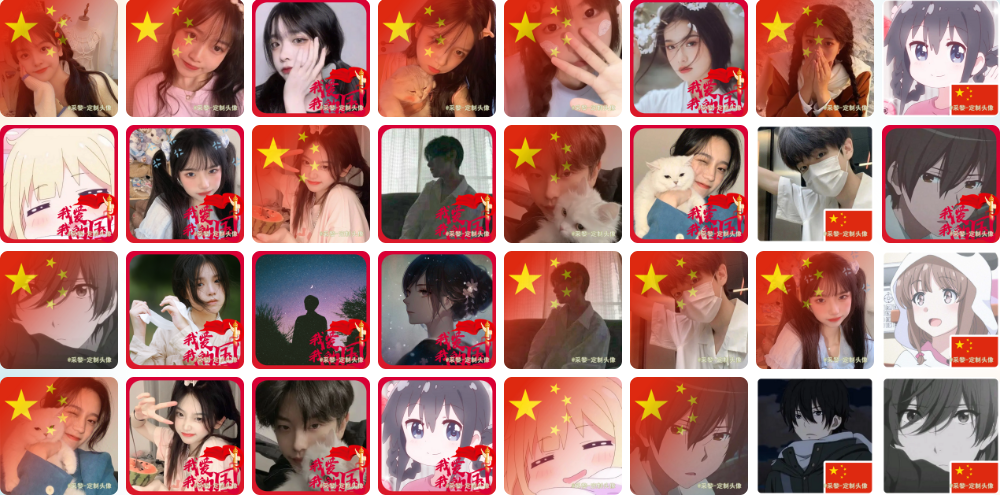

## 定制头像2.0🌈

### 前言
**『定制头像2.0』** 推出多主题风格——中秋节、国庆节、春节头像定制，其他中国传统节日陆续接入中。**喜欢的话点个⭐吧，fork请先star🙏。**

### 项目描述
定制国庆头像、红旗头像、国旗渐变头像，为祖国庆生！选择国庆、红旗、中秋节、春节等多个主题，超多头像样式和贴纸供您选择，为您的特殊时刻创造独特的头像。立即尝试我们的头像定制工具！

### 特点
操作简单，用户可定制，灵活性高。

### 预览
黎小站✈️ [https://www.xiaoli.vip/custom-avatar](https://www.xiaoli.vip/custom-avatar)

github✈️ [https://xiaoli1999.github.io/custom-avatar](https://xiaoli1999.github.io/custom-avatar)

### 效果

### 教程
1. 选择头像形状（微信为方形、qq、抖音等平台为圆形）。
2. 上传头像，（不支持动图）。
3. 选择头像框，贴纸可多选。
4. 完成上述步骤后，对效果图大小或位置不满意；可在画布区域微调，调整透明度。
5. 点击保存图片，分享给朋友。

### 开源
目前代码已开源， 如果你喜欢这个项目或使用过它，请点个star⭐，谢谢🙏🙏🙏！ 

目前效果图属于个人定制，数量有限；希望有志同道合的设计师，提供一些头像框，小黎不胜感激🙏。这个项目有您的参与变的更有意义🤝。

联系方式~**QQ: 22708206**

### 文章链接
#### 2.0版本
[**掘金**](https://juejin.cn/post/7283018190594572328)

[CSDN](https://blog.csdn.net/weixin_53673959/article/details/133343181)
#### 1.0.版本
[**掘金**](https://juejin.cn/post/7189198252460212283)

[CSDN](https://blog.csdn.net/weixin_53673959/article/details/128708172)

### 版本更新
* **v2.0.0（当前版本）**
  #### 仓库名称
  - [x] 由 **custom-rabbitImage** 改为 **custom-avatar**

  #### 页面
  - [x] 重构页面整体风格，调整为通用型风格
  - [x] 兼容pc、移动端
  - [x] 移动端头像墙采用瀑布流
  
  #### 画布相关
  - [x] 用户上传的原图做短边适配，保证不变形
  - [x] 优化元素控件效果，增加删除控件
  - [x] 优化绘制逻辑，减少无用运算。
  
  #### 新增功能
  - [x] 增加多主题选项（中秋节、国庆节、春节等，其他传统节日敬请期待）
  - [x] 增加贴纸效果，可多选、可删除
  - [x] 增加快速切换头像框功能
  - [x] 增加通知功能（xx用户在3分钟前定制了国庆头像）
  - [x] 增加分享海报功能
  - [x] 增加头像墙功能，用户可预览他人定制的头像
  
  #### 修复已知问题
  - [x] 修复qq浏览器无法选择文件
  - [x] 修复微信浏览器无法保存图片

* **v1.4.0** 
  - [x] 解决保存图片模糊问题
* **v1.3.3**
  - [x] 调整PC版版本迭代
  - [x] 调整效果图区域
  - [x] 优化页面展示
* **v1.3.2**
  - [x] 压缩静态资源，优化网站加载速度
* **v1.3.1**
  - [x] 优化新年寄语-教程描述及展示
* **v1.3.0**
  - [x] 一大批新年效果图来袭~（设计师温言）🔥🔥🔥
* **v1.2.2**
  - [x] 新增版本迭代信息弹窗
* **v1.2.1**
  - [x] 优化透明度功能滑块区域（太靠右侧易误触）
  - [x] 优化页面交互
* **v1.2.0** 
  - [x] 重构页面布局
  - [x] 新增设置效果图透明度功能
  - [x] 优化页面展示
* **v1.0.0**
  - [x] 初版
### 流程图

### 版权/协议
本项目采用 **MIT License**，请随意使用。若你喜欢或对你有所帮助，请点个⭐。

### 兼容
兼容pc、移动端等

### 计划
- 修复项目问题
- 根据用户意见、建议优化完善项目

### FAQ
有任何意见或建议请提**issues**
