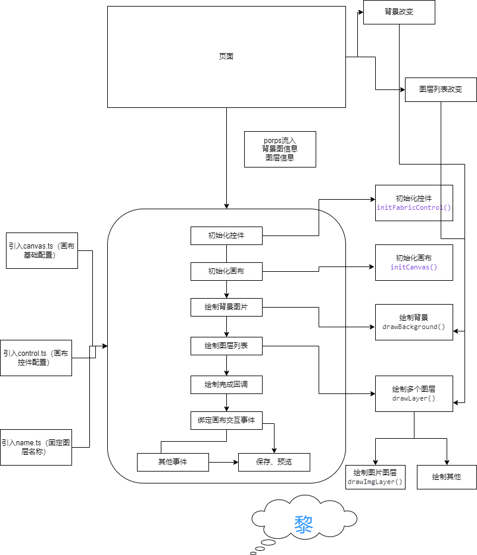

## 定制兔年春节头像🌈

> **喜欢的话点个⭐吧，fork请先star🙏。**

### 前言
辞暮尔尔，烟火年年！你好，我是黎（小黎）。在这寒冬之际，满城尽烟花，小黎为大家带来 **『定制兔年春节头像』** 小工具，希望各位喜欢。
愿诸位抱着平安，拥着健康，揣着幸福，搂着温馨，携着快乐，牵着财运，拽着吉祥，迈入新年！

### 项目描述
合成兔年春节头像

### 特点
操作简单，用户可定制，灵活性高。

### 预览
黎小站✈️ [https://www.xiaoli.vip/rabbit](https://www.xiaoli.vip/rabbit)
github✈️ [https://xiaoli1999.github.io/custom-rabbitImage](https://xiaoli1999.github.io/custom-rabbitImage)

### 效果

### 教程
1. 选择头像形状（微信为方形、qq、抖音等平台为圆形）。
2. 上传头像，尽量为宽高比1:1的头像（不支持动图）。
3. 选择喜欢的效果图（目前效果图可适配大部分头像）。
4. 完成上述步骤后，对效果图大小或位置不满意；可在左侧白框区域拖动、缩放效果图。
5. 点击预览可展示方形、圆形的成品头像（支持预览大图）。
6. 点击保存图片。

### 开源
目前代码已开源， 如果你喜欢这个项目或使用过它，请点个star⭐，谢谢🙏🙏🙏！ 
目前效果图属于个人购买，数量有限；希望有志同道合的设计师为爱发电，提供一些效果图。我会在效果图下展示设计师的名称及个人网站等链接， 并在春节会收到小黎的春节红包🧧。
若有喜欢的效果图或想要提供一些效果图，小黎不胜感激🙏。这个项目有您的参与变的更有意义🤝！
联系方式~**QQ: 22708206**

### 流程图

### 文章链接
[掘金](https://juejin.cn/post/7189198252460212283)  
[CSDN](https://blog.csdn.net/weixin_53673959/article/details/128708172)

### 版权/协议
本项目采用 **MIT License**，请随意使用。若你喜欢或对你有所帮助，请点个⭐。

### 兼容
兼容pc、移动端等

### 计划
- 修复项目问题
- 根据用户意见、建议优化完善项目

### FAQ
有任何意见或建议请提**issues**
